<div align="center">


<br/>

<a href="https://git.io/typing-svg">
  
</a>

<br/>

<a href="https://github.com/isyaau" target="_blank"></a>
<a href="https://instagram.com/isyaau23" target="_blank"></a>
<a href="https://facebook.com/IsyaauAkhsanilKhakim" target="_blank"></a>
<a href="mailto:isak.akkhsanil@gmail.com" target="_blank"></a>

</div>

---

## 👋 About Me

```yaml
name: "Isyaau Akhsanil Khakim"
location: "Indonesia"
currently_doing: "Building web applications"
hobbies: ["Coding", "Gaming", "Learning new tech"]
fun_fact: "I debug with console.log and I'm proud of it"
```

---

## 🛠️ Tech Stack

<div align="center">

#### Languages


#### Frameworks & Libraries


#### Tools & Database


</div>

---

## 📊 GitHub Stats

<div align="center">

<a href="https://github.com/isyaau">
  
  
</a>

</div>

<div align="center">

<a href="https://github.com/isyaau">
  
</a>

</div>

---

## 📈 Activity Graph

<div align="center">

[](https://github.com/ashutosh00710/github-readme-activity-graph)

</div>

---

## 🏆 Trophies

<div align="center">

[](https://github.com/ryo-ma/github-profile-trophy)

</div>

---

## 🐍 Snake Eating My Contributions

<div align="center">

> A snake slithers through my GitHub contribution graph, eating every commit it finds!


</div>

---

<div align="center">


</div>
